= Entwicklerdokumentation
:project_name: Buchhandlung
:toc: macro
:toc-title: Inhaltsverzeichnis
== __{project_name}__

[options="header"]
[cols="1, 3, 3"]
|===
|Version | Bearbeitungsdatum   | Autor
|0.1	| 08/11/21 | Flo
|0.2    | 22/01/22 | Flo
|1.0    | 23/01/22 | Flo
|===

toc::[]

:numbered:
== Einführung und Ziele

Die Buchhandlung SCHILLER benötigt zur Erweiterung des Geschäftsmodells eine Webapplikation für den Verkauf und die Verwaltung von Büchern. Jedoch haben der Geschäftsführer und seine Kolleginnen und Kollegen noch einige weiterführende Ideen:app-name:

Die Anwendung benötigt neben einer Benutzendenverwaltung auch eine Artikelverwaltung.

Zu jedem Buch muss mindestens der Autor bzw. die Autorin, der Verlag, die ISBN und eine kurze Inhaltsbeschreibung gespeichert werden.

Eine Abbildung des Buchbundes anzuzeigen, würde die Attraktivität des Verkaufsprogrammes deutlich steigern.

Die Bücher der Buchhandlung SCHILLER sind nach Genre in die Kategorien Fiktion, Sachbuch, Unterhaltung, und Ratgeber unterteilt.

Eine Möglichkeit zum nachträglichen Hinzufügen und Editieren von Genres ist wünschenswert.

Der Geschäftsinhaber denkt auch über ein Angebot von CDs und DVDs nach.

Die Benutzendenverwaltung soll die wichtigsten Angaben liefern (Name, Identifikationsnummer, Lieferadresse, Bestellungen, etc.).

Die Bezahlung der gekauften Bücher erfolgt über Rechnungsversand oder bar bei Abholung.

Bei Onlinebestellungen müssen die verkauften Artikel noch versendet werden.

Die Mitarbeitenden erledigen dies händisch nach Eingang der Zahlung und markieren die Bestellung dementsprechend.

Als zusätzliches Feature wünscht der Buchhandel SCHILLER sich einen Kalender auf der Homepage, welcher die wöchentlichen Lesungen aufführt, die in den Räumen der Buchhandlung stattfinden.

Zudem soll es pro Veranstaltung eine Übersichtsseite mit Details geben. Nutzerinnen und Nutzer können sich zwecks einer Platzreservierung für eine Lesung anmelden.

=== Qualitätsziele

Die Qualitätsziele ergeben sich aus https://iso25000.com/index.php/en/iso-25000-standards/iso-25010[ISO/IEC 25010 Software Quality Model^].

* Funktionelle Korrektheit
* Leistung & Effizienz
* Kompabilität
* Nutzbarkeit
* Verlässligkeit
* Sicherheit
* Wartbarkeit
* Portbarkeit

Die folgende Tabelle erörtert die Wichtung der unter ISO/IEC 25010 definierten Qualitätsziele

1 = unwichtig ..
5 = wichtig
[options="header", cols="3h, ^1, ^1, ^1, ^1, ^1"]
|===
|Qualitätsziel            | 1 | 2 | 3 | 4 | 5
|Funktionelle Korrektheit |   |   |   | x |
|Leistung & Effizienz     |   | x |   |   |
|Kompabilität             | x |   |   |   |
|Nutzbarkeit              |   |   |   |   | x
|Verlässligkeit           |   |   |   |   | x
|Sicherheit               |   |   |   | x |
|Wartbarkeit              |   |   | x |   |
|Portbarkeit              | x |   |   |   |
|===

== Randbedingungen
=== Hardware Spezifikationen
Liste notwendiger Hardware, um die Applikation zu betreiben/nutzen.

* Server
* Computer
* Mouse / Keyboard

=== Software-Vorgaben

Liste notwendiger Sotware, die zur Betreiben der Applikation notwendig ist.

* Java 11

Einen der folgenden Browser

* Internet Explorer / Edge 10.0
* Firefox 4.0
* Google Chrome 4.0
* Opera 9.6

=== Produktnutzung

Das System wird als Onlineshop-webpage der Buchhandlung Schiller eingesetzt werden.
Kunden sollen Bücher kaufen können und sich für Lesungen in der Buchhandlung anmelden können.

Dazu wird ein klassiches Client-Server Modell genutzt, somit sei die Software auf einem Server zu betreiben,
der 24/7 den Service als Webpage im Internet(erreichbar über einen Browser) bereitstellt.

Zudem sollte ein Admin und Mitarbeiter der Buchhandlung erweiterte Verwaltungsmaßnahmen umsetzen können z.B. Inventaränderungen verwalten, oder Kunden- und Mitarbeiterkonten verwalten.
Dafür sind für die Nutzer der Website keine weiteren technischen Kompetenzen notwendig.

== Kontextabgrenzung
=== Kontextdiagramm
// Das Kontextdiagramm zeigt das geplante Software-System in seiner Umgebung. Zur Umgebung gehören alle Nutzergruppen des Systems und Nachbarsysteme. Die Grafik kann auch informell gehalten sein. Überlegen Sie sich dann geeignete Symbole. Die Grafik kann beispielsweise mit Visio erstellt werden. Wenn nötig, erläutern Sie diese Grafik.
[[context_diagram]]
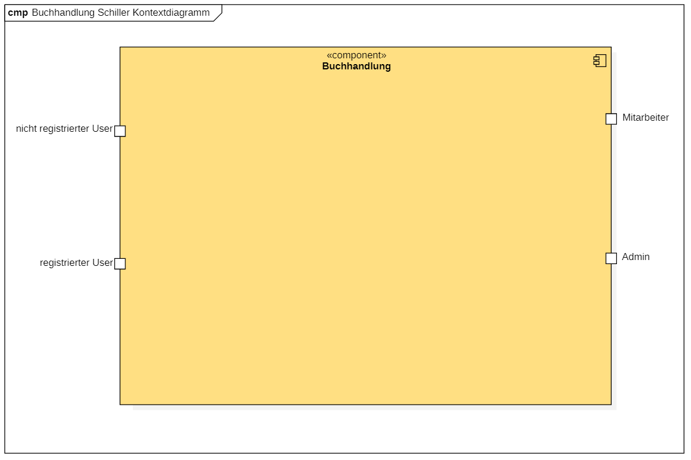

== Lösungsstrategie
=== Erfüllung der Qualitätsziele
[options="header"]
|===
|Qualitätsziel |Lösungsansatz
| Funktionelle Korrektheit a|
* Rückverfolgbarkeit Code < - > UML Diagramme
|Kompabilität a|
* Java 11
* läuft auf allen gängigen Browsern
* funktioniert sogar auf Firefox 96.0 :)
|Nutzbarkeit a|
* intuitive UI
* Instruktionen innerhalb der auszufüllenden Forms
* aria-describe-by in Teilen verwendet
* Errorseiten für Fehlleitungen auf der Website
|Verlässligkeit a|
* Da Javascript nicht Applikationslogik implementiert, wird die App auch nicht auf unterperformanten Systemen an JSOverhead verenden
|Sicherheit a|
* ThymeleafSecurity via sec:authorize
* SpringSecurity (@PreAuthorize)
* logische Teilung in Rollen (BOSS, EMPLOYEE, CUSTOMER) werden unterschiedliche Seitenzugriffsrechte zugeteilt
* Orders können mit Produkt und Uhrzeit auf genau einen Kunden zurückgeführt werden
|Wartbarkeit a|
* Modularität ist durch Klassen gegeben
* Wiederverwendbarkeit dieser Klassen in anderen Paketen der Software
* Einfache Veränderungen in einer Klasse werden in Paketen die diese verwenden direkt umgesetzt
|Leistung & Effizienz a|
* wenig JS, wenig rendering auf Clientside
|Portbarkeit a|
* <meta name="viewport" content="width=device-width, initial-scale=1.0">
* erlaubt Skalierung für Mobilfunkgeräte
|===

== Softwarearchitektur
=== Top-Level-Architektur
// Dokumentieren Sie ihre Top-Level-Architektur mit Hilfe eines Komponentendiagramm
[[top_level_architecture]]
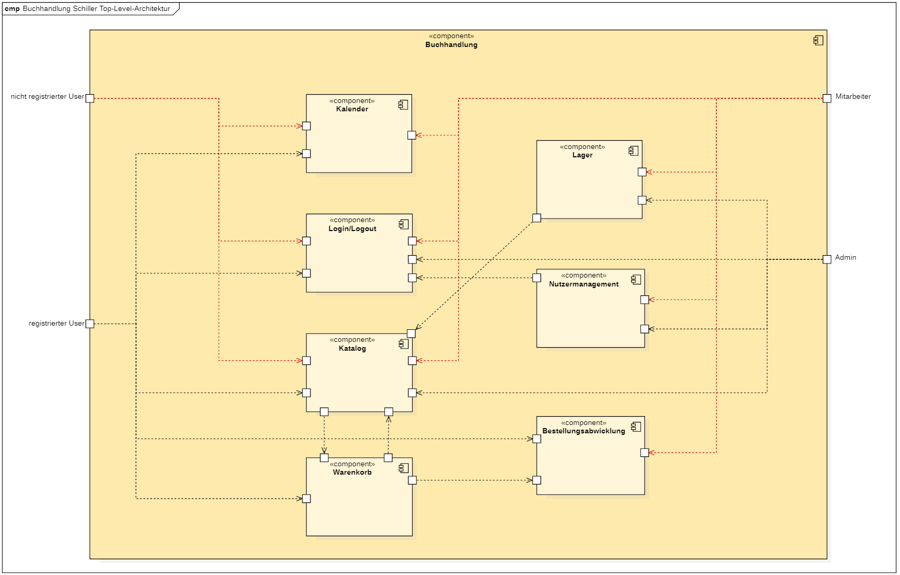

=== Entwurfsentscheidungen
==== Verwendete Muster
* Spring Mvc
* lombok
* @builder
* Logger
* Factory
* Validation Constraints
* Dependency Injection

==== Persistenz

Die WebApp nutzt Hibernate-annotationsbasierte Mappings, welche Java Classen auf H2 Datenbankobjekte abbilden.
Die Persistenz ist deaktiviert, um diese zu aktivieren sind in application.properties diese zwei Zeilen unkommentiert werden.
....
# spring.datasource.url=jdbc:h2:./db/kickstart
# spring.jpa.hibernate.ddl-auto=update
....

==== Verwendung externer Frameworks

[options="header", cols="1,2"]
|===
|Externes Package |Verwendet von (Klasse der eigenen Anwendung)
|lombok a|
* catalog.ShopItem
* catalog.AddItemForm
* catalog.ProductImage
* catalog.CatalogController
* events.CalenderController
* events.Event
* events.EventDataInitializer
* events.EventForm
* events.EventsController
* support.AnswerForm
* support.Case
* support.CreateCaseForm
* support.Message
* support.SupportController
* users.ContactForm
* order.ShopOrder
|javax.money.MonetaryAmount a|
* catalog.ShopItem
| javamoney.moneta.Money a|
* catalog.AddItemForm
* catalog.CatalogController
* catalog.ShopItemCatalogDataInitializer
| javax a|
* catalog.ShopItem
* catalog.AddItemForm
* catalog.ShopItem
* order.ShopOrder
* events.Event
* events.EventForm
* events.EventsController
* support.AnswerForm
* support.Case
* support.CreateCaseForm
* support.Message
* support.SupportController
* users.Customer
* users.EditForm
* users.Employee
* users.EmpoyeeEditForm
* users.EmployeeRegistrationForm
* users.FormUnitTest
* users.RegistrationForm
* users.UserController
* users.UserManagement
* utils.CheckEqual
* utils.CheckEqualValidator
* utils.Password
* utils.PasswordValidator
|salespointframework.catalog a|
* catalog.ShopItem
* catalog.ShopItemCatalog
* inventory.InventoryController
|salespointframework.inventory a|
* catalog.CatalogController
* catalog.CatalogControllerTets
* events.EventsController
* inventory.InventoryController
* inventory.InventoryControllerTests
* inventory.InventoryInitializer
|salespointframework.quantity a|
* catalog.CatalogController
* inventory.InventoryInitializer
* inventory.Controller
* inventory.ControllerTests
* order.OrderController
* order.OrderControllerIntegrationTests
|salespointframework.time a|
* catalog.CatalogController
* catalog.CatalogControllerTests
|salespointframework.useraccount a|
* events.EventController
* events.EventTest
* inventory.InventoryController
* order.OrderController
* order.ShopOrder
* order.ShopOrderTests
* support.AnswerForm
* support.AnswerFormTest
* support.Message
* support.SupportController
* users.*
|salespointframework.order a|
* order.OrderController
* order.ShopOrder
* order.OrderControllerIntegrationTests
* InventoryController
* InventoryControllerTests
* users.UserController
|salespointframework.core a|
* catalog.CatalogController
* catalog.AddItemForm
* catalog.ShopItemDataInitializer
* events.EventDataInitializer
* inventory.InventoryInitializer
* users.UserDataInitializer
| salespointframework.payment a|
* order.OrderController
* order.ShopOrder
* order.ShopOrderTests
|springframework.security a|
* catalog.CatalogController
* events.EventController
* events.EventControllerTests
* inventory.InventoryController
* inventory.InventoryControllerTests
* order.OrderController
* order.OrderControllerIntegrationTests
* support.SupportController
* users.UserController
* users.UserControllerWebIntegrationTests
| springframework.stereotype a|
* catalog.CatalogController
* catalog.ShopItemCatalogDataInitializer
* catalog.ImagesRepo
* contact.Contact
* inventory.InventoryController
* inventory.InventoryInitializer
* order.OrderController
* support.CaseRepository
* support.MessageRepository
* support.SupportController
* users.UserController
* users.UserDataInitializer
* users.UserManagement
|springframework.ui a|
* catalog.CatalogController
* events.CalenderController
* events.EventsController
* inventory.InventoryController
* order.OrderController
* suppoert.SupportController
* users.UserController
|springframework.util a|
* inventory.InventoryInitializer
* inventory.InventoryController
* events.CalenderController
* order.OrderController
* order.ShopOrder
* users.Customer
* users.UserController
* users.UserDataInitializer
* users.UserManagement
|springframework.data a|
* catalog.ImagesRepo
* catalog.ShopItemCatalog
* events.EventRepository
* inventory.InventoryController
* support.CaseRepository
* support.MessageRepository
* users.CustomerRepository
* users.EmployeeRepository
* users.UserManagement
* users.UserManagementTests
| springframework.validation a|
* users.UserController
* catalog.CatalogController
* users.UserController
| springframework.web a|
* Schiller
| slf4j a|
* catalog.ShopItemCatalogDataInitializer
* users.UserDataInitializer
* events.EventDataInitializer
| springframework.beans a|
* Schiller
a|
* mockito
* hamcrest
* junit
* springframework.test
* a|
* Tests

|===

== Bausteinsicht
=== Users
[[userclassdiag]]
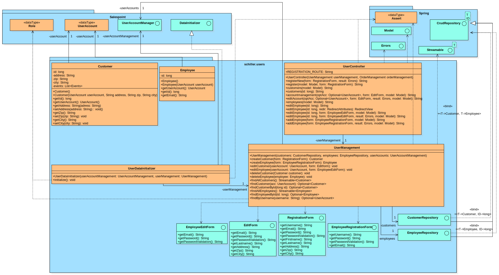

[options="header"]
|===
|Klasse/Aufzählung |Beschreibung
|Customer | Klasse die Erweiterung des Salespoint-UserAccount um Addresse, Stadt und Postleitzahl erweitert
|Employee | Implementation von Salespoint-UserAccount für Angestellte
|CustomerRepository | Repointerface welches Kunden-Instanzen verwaltet
|EmployeeRepository | Repointerface welches Angestellten-Instanzen verwaltet
|RegistrationForm | Interface für die Validierung des Registrationsformulars eines Kunden
|EditForm | Interface für die Validierung des Accounteditierformulars eines Kunden
|EmployeeRegistrationForm | Interface für die Validierung des Registrationsformulars eines Angestellten
|EmployeeEditForm | Interface für die Validierung des Accounteditierformulars eines Angestellten
|ContactForm | Interface für die Chatfunktion
|UserDataInitializer | Implementierung von Salespoint DataInitializer, für Bootstrapping von Nutzern beim Start der Applikation
|UserManagement | Service Klasse für die Verwaltung von Nutzern
|UserController | Spring Model-View-Controller Implementation
|===

=== Catalog
[[catalog_classdiagram]]
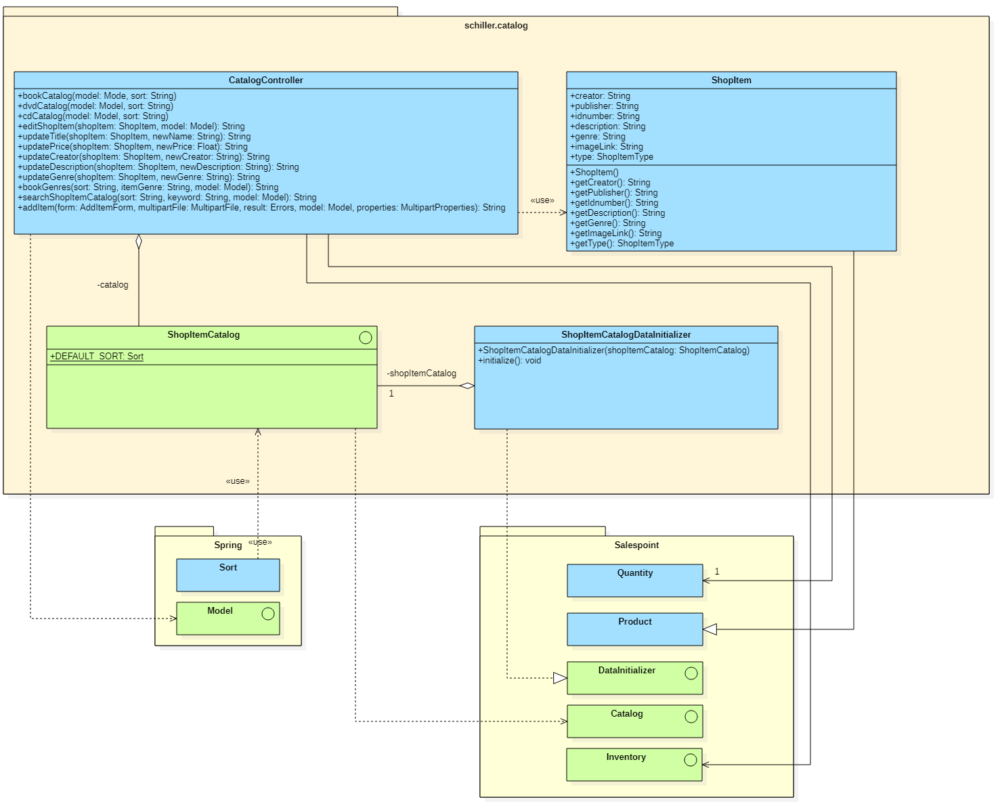

[options="header"]
|===
|Klasse/Aufzählung |Beschreibung
|CatalogController | Spring-Controller Implementation für den Katalog
|ShopItem | Produkt des Shops, entweder Buch, DVD oder CD
|ShopItemCatalog | Salespoint Implementation für den Katalog
|ShopItemCatalogDataInitializer | Salespoint Implementation des Data-Initializers für den gesamten Shop
|===

=== Inventory
[[inventory_classdiagram]]
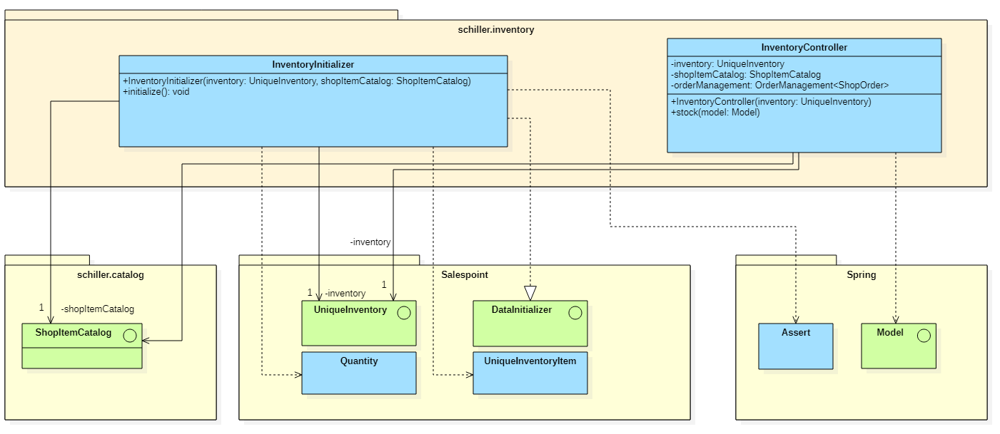

[options="header"]
|===
|Klasse/Aufzählung |Beschreibung
|InventoryInitializer | Salespoint Implementation des Data-Initializers für das Inventar
|InventoryController | Spring-Controller Implementation für das Inventar
|===

=== Order
[[order_classdiagram]]
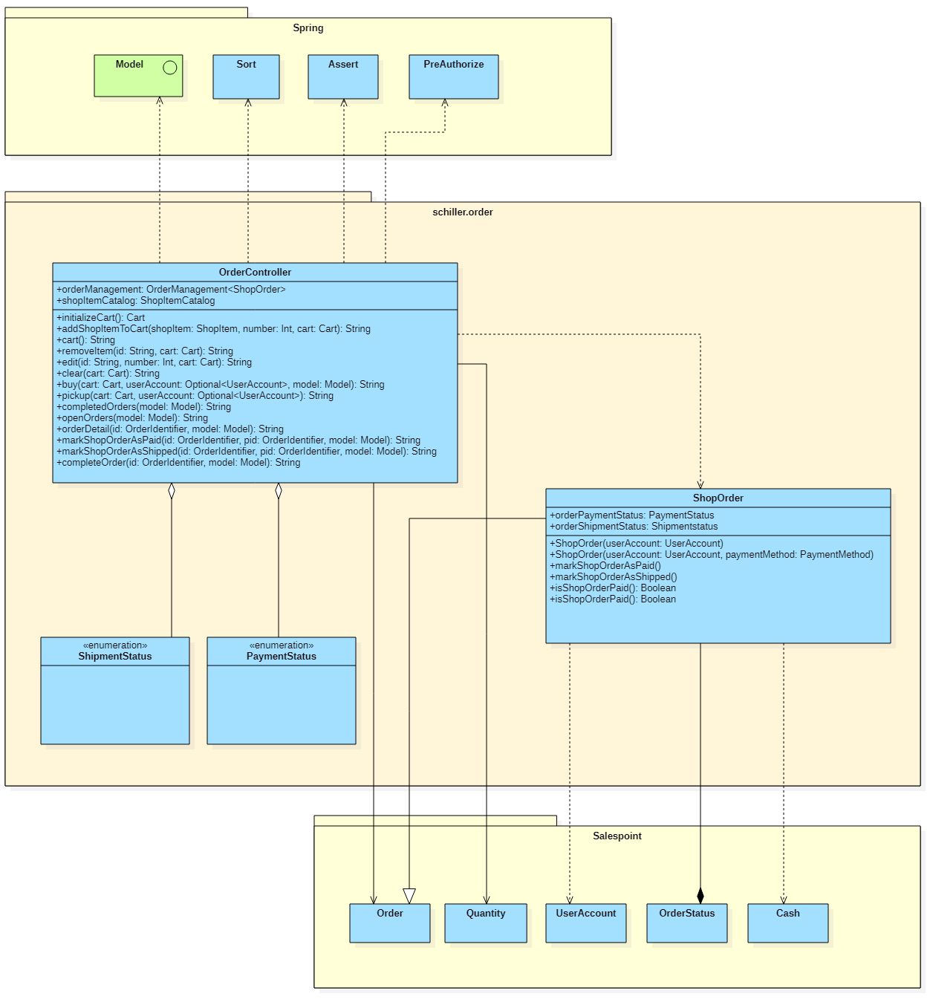

[options="header"]
|===
|Klasse/Aufzählung |Beschreibung
|OrderController | Spring-Controller Implementation für die Orders
|ShipmentStatus | Klasse, die den aktuellen Status der Bestellungen bearbeitet
|PaymentStatus | Klasse, die den aktuellenn Zahlungen und Zahlungsmethoden bearbeitet
|ShopOrder | Bestellungen und deren Status anzeigen
|===

=== Events
[[eventclassdiag]]
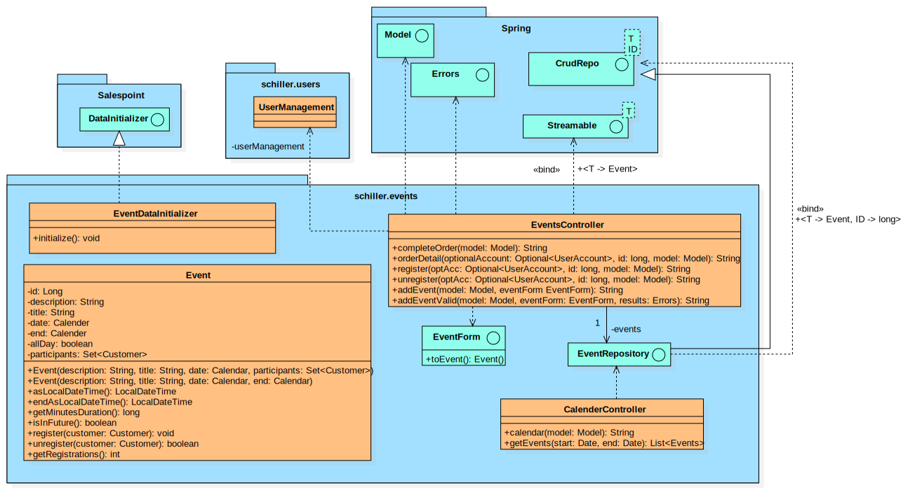

[options="header"]
|===
|Klasse/Aufzählung |Beschreibung
|Event | Implementierung der Attributlogik der Events
|EventDataInitializer | Implementierung von Salespoint DataInitializer, für Bootstrapping von Events beim Start der Applikation
|EventForm | Interface für die Kreation von Eventinstanzen
|EventRepository | Repointerface welches Instanzen von Events verwaltet
|Eventscontroller | Spring-Controller Implementation für die Events
|CalenderController |Spring-Controller Implementation für die Calender
|===

== Laufzeitsicht
* Darstellung der Komponenteninteraktion anhand eines Sequenzdiagramms, welches die relevantesten Interaktionen darstellt.

=== Users
[[userSeqdiag]]
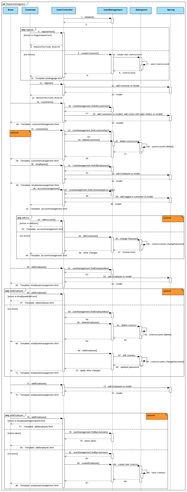

=== Catalog
[[catalogSeq]]
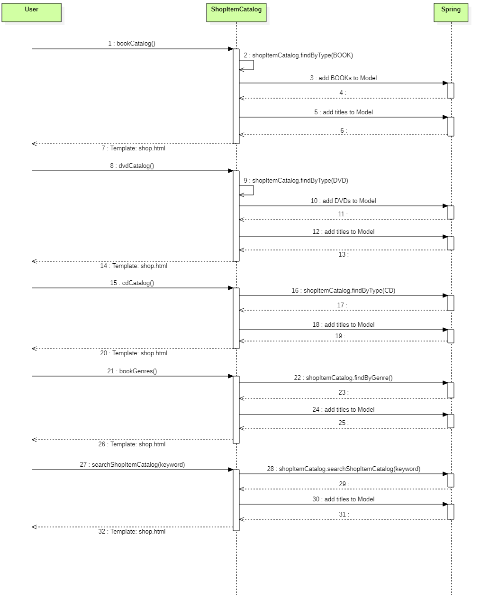

=== Inventory
[[inventorySeqdiag]]
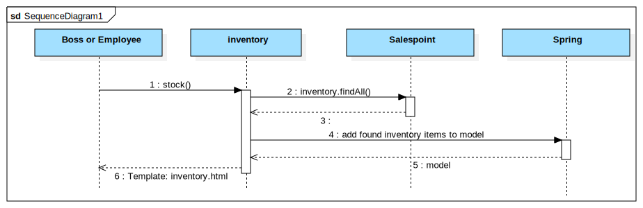

=== Order
[[orderSeqdiag]]
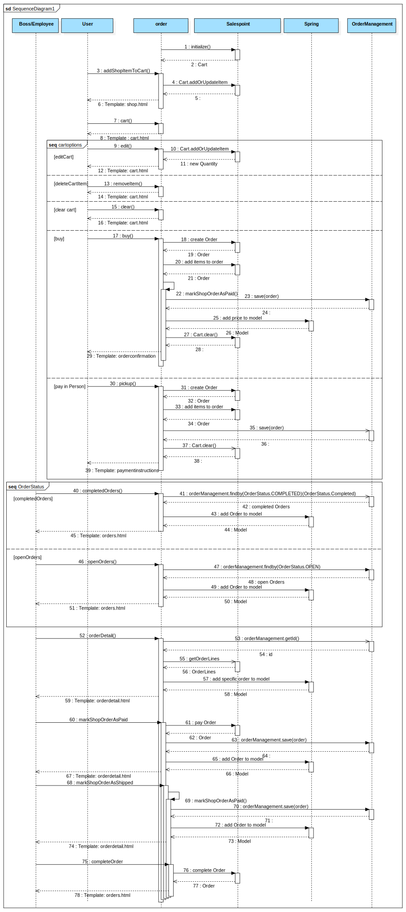

=== Events
[[eventSeqdiag]]
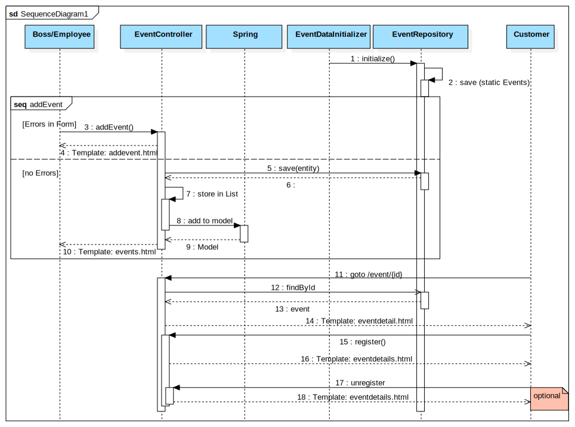

== Technische Schulden
[options="header"]
|===
|Quality Gate | Actual Value | Goal
|Reliability | A | A
|Security | A | B
|Maintainability | A | C
|Coverage | 58.3% | 50.0%
|===
* keine Bugs, Codesmells, Vulnerabilities, Security Hotspots
* 0,9 % Codeduplikate, welche sich alle in einer Klasse (Orderkontroller) befinden und zur logischen Abgrenzung sinnvoll sind

== Testdaten
Hier stehen die statisch vordefinierten Zugangsdaten für Testzwecke
|===
|Benutzername |Passwort |Rolle
|boss |123 |boss
|bob |123 |employee
|test |123 |customer
|===
