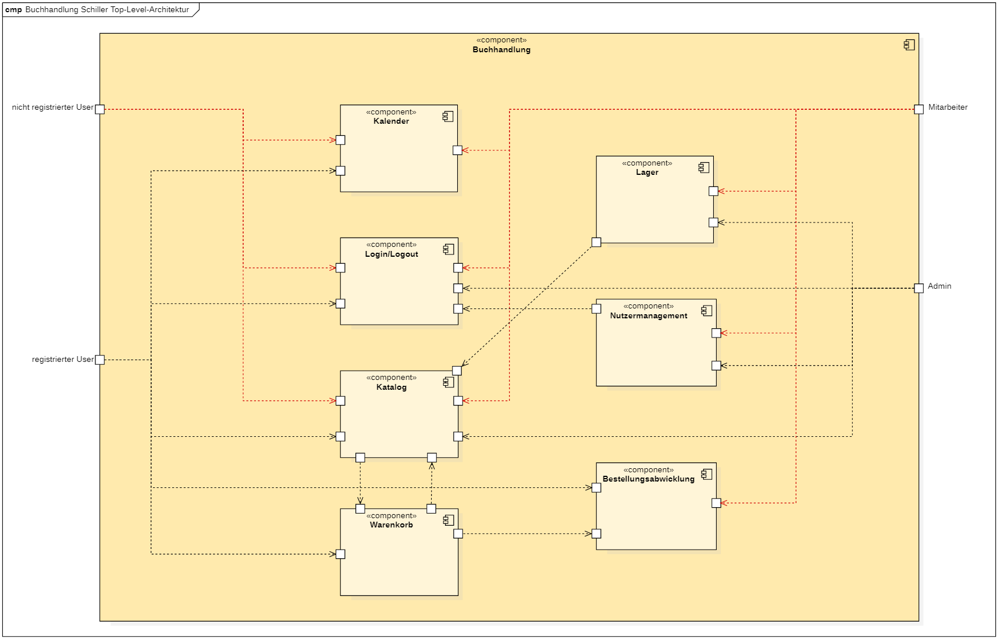
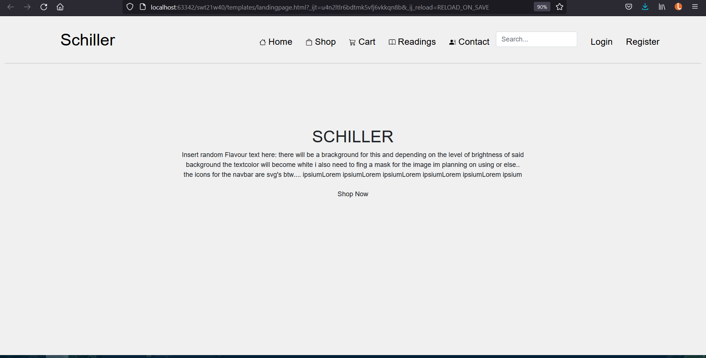

= Pflichtenheft
:project_name: Buchhandlung
:toc: macro
:toc-title: Inhaltsverzeichnis
== __{project_name}__

[options="header"]
[cols="1, 1, 1, 1, 4"]
|===
|Version | Status      | Bearbeitungsdatum   | Autoren(en) |  Vermerk
|0.1     | In Arbeit   | 10.10.2021          | Autor       | Initiale Version
|1.0     | Fertig      | 23.01.2022          | Flo         | Finale Version
|===

// Dieses Dokument benötigt ein Inhaltsverzeichnis. Es existieren mehrere Einbindungsmöglichkeiten.
toc::[]

:numbered:
== Zusammenfassung
Dieses Dokument dient der Übersicht des Projektes "Buchhandlung Schiller" und soll dessen Funktionalitäten, Akteure und Anwendungsanforderungen erläutern.

== Aufgabenstellung und Zielsetzung
Die Buchhandlung SCHILLER benötigt zur Erweiterung des Geschäftsmodells eine Webapplikation für den Verkauf und die Verwaltung von Büchern. Jedoch haben der Geschäftsführer und seine Kolleginnen und Kollegen noch einige weiterführende Ideen:app-name: 

Die Anwendung benötigt neben einer Benutzendenverwaltung auch eine Artikelverwaltung. 

Zu jedem Buch muss mindestens der Autor bzw. die Autorin, der Verlag, die ISBN und eine kurze Inhaltsbeschreibung gespeichert werden. 

Eine Abbildung des Buchbundes anzuzeigen, würde die Attraktivität des Verkaufsprogrammes deutlich steigern. 

Die Bücher der Buchhandlung SCHILLER sind nach Genre in die Kategorien Fiktion, Sachbuch, Unterhaltung, und Ratgeber unterteilt. 

Eine Möglichkeit zum nachträglichen Hinzufügen und Editieren von Genres ist wünschenswert. 

Der Geschäftsinhaber denkt auch über ein Angebot von CDs und DVDs nach. 

Die Benutzendenverwaltung soll die wichtigsten Angaben liefern (Name, Identifikationsnummer, Lieferadresse, Bestellungen, etc.). 

Die Bezahlung der gekauften Bücher erfolgt über Rechnungsversand oder bar bei Abholung. 

Bei Onlinebestellungen müssen die verkauften Artikel noch versendet werden. 

Die Mitarbeitenden erledigen dies händisch nach Eingang der Zahlung und markieren die Bestellung dementsprechend.

Als zusätzliches Feature wünscht der Buchhandel SCHILLER sich einen Kalender auf der Homepage, welcher die wöchentlichen Lesungen aufführt, die in den Räumen der Buchhandlung stattfinden. 

Zudem soll es pro Veranstaltung eine Übersichtsseite mit Details geben. Nutzerinnen und Nutzer können sich zwecks einer Platzreservierung für eine Lesung anmelden.

== Produktnutzung
Das Programm wird als Shop-Software im Buchhandlung Schiller eingesetzt. Dabei wird es primär von dem Chef, Mitarbeiter und Kunden im Laden verwendet.

Das Programm wird als Web-Application im Browser laufen.

Das Programm soll bei der Nutzung intuitiv sein und auch später keinen technischen Hintergrund benötigen, um die Software am laufen zu halten.

== Interessensgruppen (Stakeholders)
|===
|Name |Priorität (1..5) |Beschreibung |Ziele
|Schiller Buchhandlung
|5
| Chef des Buchhandlungs und Admin des Programms. der Software seien.
a|
* Treffen alle wichtige Entscheidungen und haben unbegrenzte Rechte im Programm
|Mitarbeiter
|4
| Alle Mitarbeiter sind erlaubt, die Software zu verwenden.
a|
* Bedienen der Kundschaft mithilfe der Software
|Kunden
|4
| Kunden müssen das Software leicht un intinuitiv benutzen können.
a|
* Kann Bücher bestellen, sich für Events anmelden.
|Entwickler
|3
| Die Entwickler dieses Programms sind die Mitglieder der Gruppe 40.
a|
* Erfüllen aller Anforderungen
* Zufriedenstellen des Kunden
|===

== Systemgrenze und Top-Level-Architektur

=== Kontextdiagramm
// Das Kontextdiagramm zeigt das geplante Software-System in seiner Umgebung. Zur Umgebung gehören alle Nutzergruppen des Systems und Nachbarsysteme. Die Grafik kann auch informell gehalten sein. Überlegen Sie sich dann geeignete Symbole. Die Grafik kann beispielsweise mit Visio erstellt werden. Wenn nötig, erläutern Sie diese Grafik.
[[context_diagram]]
image:./models/analysis/Kontextdiagramm.png[context_diagram]

=== Top-Level-Architektur
// Dokumentieren Sie ihre Top-Level-Architektur mit Hilfe eines Komponentendiagramm
[[top_level_architecture]]

== Anwendungsfälle

=== Akteure

[options="header"]
[cols="1,4"]
|===
|Name |Beschreibung
|Benutzer  |Repräsentiert eine jede Person die mit dem System interagiert. Jeder Benutzer hat eine der 5 Rollen (unregistriert, registriert, käufer, mitarbeiter, boss)
|Unregistrierter Benutzer  |Ein unregistrierter Benutzer hat nur beschränkten Zugriff auf die Anwendung. Durch die Registrierung bekommt der unregistrierte Benutzer die Rolle "registriert".
|Registrierter Benutzer  |Registrierte Benutzer haben die Möglichkeit auf den Katalog, Kalender und ihren Warenkorb zuzugreifen. Außerdem können sie ihr Konto verwalten und sich abmelden.
|Mitarbeiter  |Mitarbeiter sind registrierte Benutzer mit erweiterten Berechtigungen. Sie haben Zugriff auf die Verwaltungsoptionen der Anwendung.
|Boss  |Benutzer mit der Rolle "boss" sind Mitarbeiter mit nochmals erweiterten Berechtigungen. Als "boss" hat man die Möglichkeit die Umsätze einzusehen und die Konten der Benutzer mit der Rolle "mitarbeiter" zu bearbeiten.
|===

=== Überblick Anwendungsfalldiagramm
[[use_case_diagram]]

Anwendungsfall-Diagramm, das alle Anwendungsfälle und alle Akteure darstellt

=== Anwendungsfallbeschreibungen

[cols=",",]
|===
|ID |

|Name |Login/Logout

|Beschreibung |Der Nutzer meldet sich an um Zugriff auf sein Konto und erweiterten
Zugriff auf die Anwenng zu bekommen.

|Akteur |Benutzer

|Trigger a|
Login: Benutzer möchte Zugriff auf bestimmte Funktionen des Shops.

Logout: Benutzer möchte den Shop verlassen

|Voraussetzungen a|
Login: Benutzer ist nicht angemeldet

Login: Benutzer ist angemeldet

|Nötige Schritte a|
Login:

{empty}1. Benutzer gibt seine Daten ein

{empty}2. Benutzer drückt "Login" Button

Logout:

{empty}1. Benutzer drückt "Logout" Button

|Erweiterungen | /

|Funktionale Anforderungen | HTML + CSS Clientsiderendering
|===

[cols=",",]

|===
|ID |

|Name |Registrierung

|Beschreibung |Der Nutzer muss sich erst registrieren um die Login Funktion nutzen zu können.

|Akteur |Unregistrierter Benutzer

|Trigger a|Der Nutzer möchte die Funktionen des Shops nutzen,
die nur angemeldeten Nutzer zur Verfügung stehen

|Voraussetzungen a|Der Nutzer ist noch nicht registriert.

|Nötige Schritte a|
{empty}1. Benutzer gibt benötigte Daten ein.

{empty}2. Benutzer drückt "Registrieren" Button

|Erweiterungen | /

|Funktionale Anforderungen | HTML + CSS Clientsiderendering
|===

[cols=",",]

|===
|ID |

|Name |Benutzerkonto bearbeiten

|Beschreibung |Der Benutzer kann sein Konto bearbeiten oder ganz löschen.

|Akteur |Benutzer

|Trigger a|Benutzer möchte Konto löschen oder private Daten (z.B. Adresse) ändern.

|Voraussetzungen a|Benutzer ist angemeldet

|Nötige Schritte a|
Daten ändern:

{empty}1. Neue Daten eingeben

{empty}2. "Änderungen Bestätigen" Button drücken

Konto löschen:

{empty}"Bestätigen" Button drücken

|Erweiterungen | /

|Funktionale Anforderungen | HTML + CSS Clientsiderendering
|===

== Funktionale Anforderungen

== Muss-Kriterien

[cols="1, 1, 1, 4"]
|===
| ID 
| Version
| Name
| Beschreibung

|[[F0100]]<<F0100>>
| v0.1 
| Authentifikation
a| Das System zeigt bestimmte Seiten nur nach der Authentifikation. Dabei wird zwischen Kunde, Mitarbeiter und Admin (Chef) unterschieden. Jeder Nutzer kann sich durch eingabe der folgenden Informationen authorisieren.

* Nutzername
* Passwort
 

|[[F0110]]<<F0110>>
| v0.1
| Navigations-Leiste-Admin
a| Das Shop-Interface beinhaltet eine Navigationsleiste, die in dieser Form nur von Admin benutzt werden kann, da nur er authentisiert(<<F0100>>) werden kann. Auf dieser werden folgende
Unterpunkte aufgeführt:

* Home-Seite(<<F0120>>)
* Katalog(<<F0130>>)
* Bestellungsübersicht(<<F0400>>)
* Rechnungsübersicht(<<F0500>>)
* Kalendar(<<F0200>>)
* Warenkorb(<<F0410>>)
* Mitarbeiter

|[[F0111]]<<F0111>>
| v0.1
| Navigations-Leiste-Kunde
a| Das Shop-Interface beinhaltet eine Navigationsleiste, die nicht alle Funktionen des Admins Navigation-Leiste(<<F0110>>) besitzt und sollte vom Kunde benutzt werden. Auf dieser werden folgende
Unterpunkte aufgeführt:

* Home-Seite(<<F0120>>)
* Katalog(<<F0130>>)
* Kalendar(<<F0213>>)
* Warenkorb(<<F0410>>)

|[[F0111]]<<F0112>>
| v0.1
| Navigations-Leiste-Mitarbeiter
a| Das Shop-Interface beinhaltet eine Navigationsleiste, die nicht alle Funktionen des Admins Navigation-Leiste(<<F0110>>) besitzt und sollte vom Kunde benutzt werden. Auf dieser werden folgende
Unterpunkte aufgeführt:

* Home-Seite(<<F020>>)
* Katalog(<<F00130>>)
* Kalendar(<<F0213>>)
* Warenkorb(<<F0410>>)
* Bestellungsübersicht(<<F0400>>)
* Rechnungsübersicht(<<F0500>>)

|[[F0120]]<<F0020>>
| v0.1
| Home-Seite
a| Das System muss eine Home-Seite besitzen, die die Rolle hat, den Laden kurz zu präsentieren. Es muss die folgenden Elemente erhalten:

* Adresse vom Laden
* Bild
* Name des Ladens
* Kalendar für Events

Die Home-Seite können alle Nutzer benutzen(<<F0110>>)(<<F0111>>)

|===

==== Katalog
[cols="1, 1, 1, 4"]
|===
| ID
| Version
| Name

| Beschreibung
|[[F0130]]<<F0130>>
| v0.1
| Katalog(Admin/Mitarbeiter)
a| Das System bietet die Möglichkeit den Bestand des Ladens anzuzeigen. Die Kataloge bieten den Schef dabei die Möglichkeit Bücher zu bestellen und deren Menge zu ändern. 

|[[F0131]]<<F0131>>
|v0.1
|Katalog (Kunde)
a| Es existiert  ein Katalog im System, wo die Kunden Bücher sortieren, sehen und kaufen können.

|[[F0131]]<<F0132>>
|v0.1
|Suchmaschine
a| Es existiert eine Suchmachine, wo jeder nach Bücher suchen kann und diese nach Preis/Genre filtrieren.

|===

==== Kalendar
[cols="1, 1, 1, 4"]
|===
| ID
| Version
| Name
| Beschreibung

|[[F0200]]<<F0200>>
| v0.1
| Kalendar
a| Das Programm unterstützt das Anbieten von verschiedenen Events, von denen der Kunde wählen kann. Diese Events stehen im Kalendar des Programms, wo der Admin neue Event hinzufügen oder entfernen kann. Kalendar befindet sich auf der Home-Seite

Der Kalendar können alle Nutzer einsehen(<<F0110>>)(<<F0111>>)

|[[F0210]]<<F0210>>
| v0.1
| Bestätigung vom Teilnahme an Events
a| Jeder Kunde kann zustimmen/absagen or sie teil an einem Event nehmen können und sich für Events eintragen und eine Bestätigung bekommen.

|[[F0220]]<<F0220>>
| v0.1
| Auflistung der Events
a| Alle Events sind chronologisch im Kalender aufgelistet.
|===

==== Bestandssystem
[cols="1, 1, 1, 4"]
|===
| ID
| Version
| Name
| Beschreibung

|[[F0300]]<<F0300>>
| v0.1
| Bestandssystem
a| Das Bestandssystem speichert welche Bücher der Schef in ihrem Laden hat. Für die Speicherung werden folgende Informationen gegeben:

* Buchname
* Menge
* Beschreibung
* Bild eines Buchs
* Einkaufspreis
* ISBN Code
* Author/in

|[[F0310]]<<F0310>>
| v0.1
| Aufnehmen von Bücher
a|Der Admin/Mitarbeiter kann beliebige, neue Bücher in den lokalen Bestand aufnehmen.

|[[F0311]]<<F0311>>
| v0.1
| Entfernen von Produkten
a| Der Admin/Mitarbeiter hat die Möglichkeit Bücher aus dem lokalen Bestand zu entfernen.

|[[F0330]]<<F0312>>
| v0,1
| Abfragen des Bestandssystems
a| Der lokale Bestand kann abgefragt werden.
|===

==== Ordersystem
[cols="1, 1, 1, 4"]
|===
| ID
| Version
| Name
| Beschreibung
|[[F0400]]<<F0400>>
| v0.1
| Bestellungsübersicht
a|  Die Bestellungsübersicht ist der Teil des Systems, in dem der Admin/Mitarbeiter eine Liste mit allen ausstehenden Bestellungen finden kann. Hier kann er auch Bestellungen stornieren, wenn nötig.

|[[F0401]]<<F0401>>
| v0.1
|  Datensatz zu ausstehenden Bestellungen
a| Im Bestandssystem kann man eine Ansicht zu den ausstehenden Bestellungen finden. Dort sind die folgenden Informationen erhalten:

* Anzahl von Produkten
* Art der Produkte
* Kaufdatum
* Preis
* Versandart

|[[F0410]]<<F0410>>
| v0.1
| Warenkorb
a| Hier werden die Produkte, zwischengespeichert. Alle Benutzer können es benutzen.

|[[F0411]]<<F0411>>
| v0.1
| Warenkorbübersicht
a| Das System macht es möglich die Waren, sowie Preis und Gesamtpreis im Warenkorb ansehen zu können.

|[[F0412]]<<F0412>>
| v0.1
| Warenkorbinhalt verwalten
a| Im Warenkorbübersicht gibt es die Möglichkeit den Warenkorbinhalt zu sehen und zu bearbeiten.

|[[F0413]]<<F0413>>
| v0.1
| Warenkorbpreis berechnen
a| Bei der Verwaltung vom Warenkorbinhalt kann der gesamte Preis berechnet und gezeigt werden.

|[[F0420]]<<F0414>>
| v0.1
| Bestätigung des Einkaufs
a| Im Warenkorb kann der Admin/Mitarbeiter einen Einkauf bestätigen.

|===

==== Rechnungssystem
[cols="1, 1, 1, 4"]
|===
| ID
| Version
| Name
| Beschreibung

|[[F0501]]<<F0501>>
| v0.1
| Einnahmen
a| Im Rechnungssystem können Einnahmen und Informationen dazu gezeigt werden.

|[[F0502]]<<F0502>>
| v0.1
| Quittung 
a| Im Rechnungssystem kann eine Quittung ausgegeben werden.

|[[F0503]]<<F0503>>
| v0.1
| Ausgaben
a| Im Rechnungssystem können Ausgaben und Informationen dazu gezeigt werden. 

|[[F0510]]<<F0510>>
| v0.1
| Datensatz von Rechnungen 
a| Der Datensatz von Rechnung enthält die folgende Einträge:

* Bestellnummer
* Datum
* Höhe der Zahlung
* Inhalt des Einkaufs

|[[F0520]]<<F0520>>
| v0.1
| Rechnungsübersicht: Fällige Zahlungen
a| Man kann in der Rechnungsübersicht alle fälligen Zahlungen einsehen und hat die Möglichkeit diese als bezahlt zu markieren.

|[[F0540]]<<F0530>>
| v0.1
| Zahlung löschen
a| Bei Fehlern können Chef/Mitarbeiter im Rechnungssystem augewählte Zahlungen komplett löschen.

|===

==== Profile
[cols="1, 1, 1, 4"]
|===
| ID 
| Version
| Name
| Beschreibung

|[[F0600]]<<F0600>>
| v0.1
| Persönliches Profile
a| Das System erlaubt den User eienn Profile zu erstellen, wo persönliche Informationen stehen. Es gibt 3 Arten von Profiles:

*Admin
*Mitarbeiter
*Kunde

|[[F0610]]<<F0610>>
| v0.1
| Neue Rolen erstellen
a| Der Admin kann neue Arten von Profiles erstellen und löschen. So kann der Admin die Menge von verschiedenen Rollen erweitern

|===

=== Kann-Kriterien
Anforderungen die das Programm leisten können soll, aber für den korrekten Betrieb entbehrlich sind.

[cols="1, 1, 1, 4"]
|===
|ID
| Version
| Name
| Beschreibung

|[[K0010]]<<K0010>>
| v0.1
| Inventur 
a| Das Programm kann, als Teil des Bestandssystems eine automatische Inventur machen, welche am Ende des Tages bestätigt werden kann 

|[[K0020]]<<K0020>>
| v0.1
| Dark-Mode
| Dieses Feature schaltet auf eine dunklere Alternative der Farbpalette, welche vom Interface verwendet wird. 

|[[K0040]]<<K0040>>
| v0.1
| Animation
| Es sind eine Hand voll Animationen denkbar, welche das Programm optisch ansprechender machen können. Vorallem wenn das Nutzer Feature implementiert wurde, könnte man somit dem Kunden eine bessere Kauferfahrung bieten.
|===

== Qualitätsziele

Die Qualitätsziele ergeben sich aus https://iso25000.com/index.php/en/iso-25000-standards/iso-25010[ISO/IEC 25010 Software Quality Model^].

* Funktionelle Korrektheit
* Leistung & Effizienz
* Kompabilität
* Nutzbarkeit
* Verlässligkeit
* Sicherheit
* Wartbarkeit
* Portbarkeit

Die folgende Tabelle erörtert die Wichtung der unter ISO/IEC 25010 definierten Qualitätsziele

1 = unwichtig ..
5 = wichtig
[options="header", cols="3h, ^1, ^1, ^1, ^1, ^1"]
|===
|Qualitätsziel            | 1 | 2 | 3 | 4 | 5
|Funktionelle Korrektheit |   |   |   | x |
|Leistung & Effizienz     |   | x |   |   |
|Kompabilität             | x |   |   |   |
|Nutzbarkeit              |   |   |   |   | x
|Verlässligkeit           |   |   |   |   | x
|Sicherheit               |   |   |   | x |
|Wartbarkeit              |   | x |   |   |
|Portbarkeit              | x |   |   |   |
|===

== GUI Prototyp

Im folgenden wird der Basisentwurf der grafischen Oberfläche des Webshops vorgestellt.

Geplant ist eine Hoverfunktion zu verwenden, um die aktuelle Seite auf der man sich befindet hervorzuheben.

[[home_image]]

[[registration_image]]

[[login_image]]

[[accountmanagement_image]]

[[shop_image]]

[[cart_image]]

[[inventory_image]]

[[customermanagement_image]]

[[employeemanagement_image]]

[[readings_image]]

=== Überblick: Dialoglandkarte

[options="header"]
|===
|Navigationsbarlink | Funktionalität
| Home              | Öffnet die Startseite
| Shop              | Öffnet den Shop
| Cart              | Öffnet den Warenkorb (nur für eingelogte Nutzer sichtbar)
| Readings          | Öffnet die Vorlesungsseite ()
| Contact           | Öffnet die Kontaktseite ()
| Search            | Durchsucht den Shop nach Inventargegenständen
| Inventory         | (nur für Admin sichtbar), öffnet Inventarseite
| Orders            | (nur für Admin sichtbar), öffnet Bestellseite
| Usermanagement    | (nur für Admin sichtbar), öffnet Dropdownmenü in welchem sich
| Manage Employees  | öffnet die Angestelltenverwaltungsseite (aus Dropdown Usermanagement sichtbar)
| Manage Customers  | öffnet die Kundenverwaltungsseite (aus Dropdown Usermanagement sichtbar)
| Account           | Öffnet ein Dropdownmenü welches Registration, Login/Logout und Nutzeraccountverwaltung für den jeweiligen Nutzer beinhaltet
| Register          | Öffnet Registrationsseite (aus Dropdownmenü Account sichtbar)
| Login             | Öffnet Loginseite (aus Dropdownmenü Account sichtbar)
| Logout            | loggt den Nutzer aus der Session aus und wirft ihn auf die Startseite (aus Dropdownmenü Account sichtbar)
| Manage Account    | Öffnet Accountverwaltungsseite des jeweiligen eingeloggten Nutzers (aus Dropdownmenü Account sichtbar)
|===

== Datenmodell

=== Klassen und Enumerationen

// See http://asciidoctor.org/docs/user-manual/#tables
[options="header"]
|===
|Klasse/Enumeration |Beschreibung
| Bookshop                  |Zentrale Klasse die den Buchladen selbst repräsentiert
| Customer                  |Ein Kunde, also eine echte Person die Kunde im Bücherladen ist
| Reading                   |Ein Lesungsevent
| EventProgramm             |Eine Liste an Events
| Role                      |Eine Rolle die ein User haben kann
| Order                     |Eine Bestellung
| OrderLog                  |Alle aufgegebenen Bestellung
| Shipmentstatus            |Der Status einer Lieferung
| Paymentstatus             |Der Bezahlstatus einer Lieferung
| Cart                      |Ein Einkaufswagen in den Kunden Produkte legen können die sie kaufen wollen
| CartItem                  |Ein Item im  Einkaufswagen
| Product                   |Ein allgemein verkaufbares Produkt
| Book                      |Ein verkaufbares Buch
| Catalog                   |Eine Liste an Produkten
| Inventory                 |Alle Produkte auf Lager
| ProductStock              |Ein Produkt auf lager
|===

== Akzeptanztestfälle
Mithilfe von Akzeptanztests wird geprüft, ob die Software die funktionalen Erwartungen und Anforderungen im Gebrauch erfüllt.

Da sich die Anforderungen an das Projekt durch veränderte Bedingungen oder Wünsche o. Ä. von den Stakeholdern ändern können, wird diese Liste sukzessiv fortgeführt und ggf. ergänzt.
[cols="1h, 4"]
[[AT001]]
|===
|ID|<<AT001>>
|Vorbedingung|Das System hat existierende Benutzer.
|Event|Ein nicht authentifizierter Benutzer möchte sich über die Login-Seite anmelden. Dafür verwendet er die für ihn bei der Registrierung hinterlegten Zugangsdaten.
|Erwartetes Ergebnis|Der User ist authentifiziert und erhält auf die für ihn verfügbaren Seiten und Funktionen Zugriff.
|===
[cols="1h, 4"]
[[AT002]]
|===
|ID|<<AT002>>
|Vorbedingung|Das System hat existierende Benutzer.
|Event|Ein authentifizierter Benutzer möchte sich über die für den Ausloggen-Button abmelden. Dafür wählt er einmalig den "Ausloggen" Button an..
|Erwartetes Ergebnis|Der User ist nun abgemeldet und damit nicht mehr authentifiziert. Sein Funktionsumfang wird eingeschränkt.
|===
[cols="1h, 4"]
[[AT003]]
|===
|ID|<<AT003>>
|Vorbedingung|Der Benutzer benutzt die Anwendung.
|Event|Ein nicht authentifizierter Benutzer möchte sich über die Registrieren-Seite in der Applikation registrieren.
|Erwartetes Ergebnis|
Es wird geprüft, ob der Benutzer bereits registriert ist oder ob die von ihm verwendeten Daten (insbesondere Passwort) den Anforderungen entsprechen. Wenn nicht, wird eine Fehlermeldung ausgegeben. Sofern alles korrekt angegeben wurde, ist der Nutzer nun registriert und wird weitergeleitet.
|===
[cols="1h, 4"]
[[AT004]]
|===
|ID|<<AT004>>
|Vorbedingung|Das System hat existierende Benutzer.
|Event|Ein nicht authentifizierter Benutzer möchte sich über die Login-Seite anmelden. Dafür verwendet er die für ihn bei der Registrierung hinterlegten Zugangsdaten.
|Erwartetes Ergebnis|Der User ist authentifiziert und erhält auf die für ihn verfügbaren Seiten und Funktionen Zugriff.
|===
[cols="1h, 4"]
[[AT005]]
|===
|ID|<<AT005>>
|Vorbedingung|Der Benutzer ist authentifiziert und es existiert eine reservierungspflichtige Veranstaltung im Kalender.
|Event|Der Benutzer möchte seine Zu- oder Absage zur Veranstaltung mitteilen.
|Erwartetes Ergebnis|Im System wird hinterlegt, ob der Benutzer an der Veranstaltung teilnehmen will oder nicht.
|===
[cols="1h, 4"]
[[AT006]]
|===
|ID|<<AT006>>
|Vorbedingung|Der Benutzer ist als Mitarbeiter authentifiziert.
|Event|Der Mitarbeiter möchte das Inventar einsehen und dieses aufstocken.
|Erwartetes Ergebnis|Ihm wird eine Liste an Inhalten des Inventars präsentiert. Er kann dann über eben diese Seite das Inventar aufstocken.
|===
[cols="1h, 4"]
[[AT007]]
|===
|ID|<<AT007>>
|Vorbedingung|Der Benutzer ist als Kunde authentifiziert. Es existieren Produkte und der Kunde hat ein Produkt in seinem Warenkorb abgelegt.
|Event|Der Benutzer möchte seine Bestellung aufgeben.
|Erwartetes Ergebnis|Die Bestellung wird im System registriert. Der Kunde wird darüber informiert, dass der Betreiber des Shops seine Bestellung erhalten hat.
|===